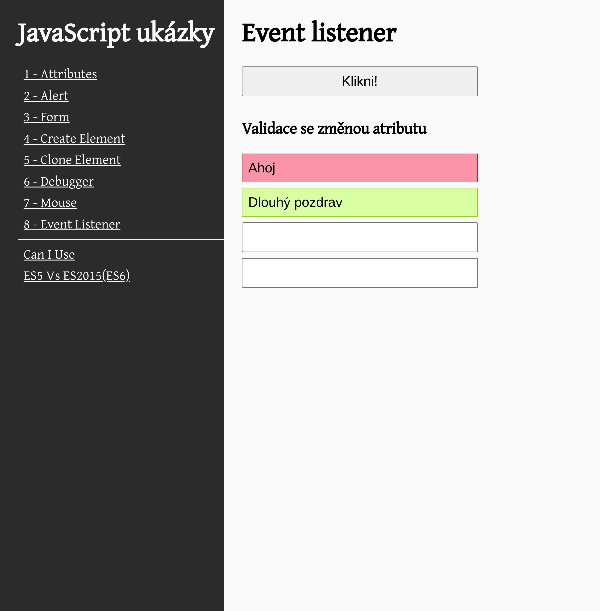

# KIT-IWWW - Responsive

V této ukázce kódů naleznete základy pro vytvoření responsivného designu. 
Konkrétně úprava základních prvků pro zobrazení na menších zařízeních
- navigace (hamburger menu)
- přeuspořádání elementů stránky ( z horizontální zobrazní na vertikální)

V rámci vylepšení resposivity webu lze dále udělat například
[responsivní zobrazení obrázků](https://developer.mozilla.org/en-US/docs/Learn/HTML/Multimedia_and_embedding/Responsive_images) (různé velikosti obrázků pro různá zařízení/rozlišení).

