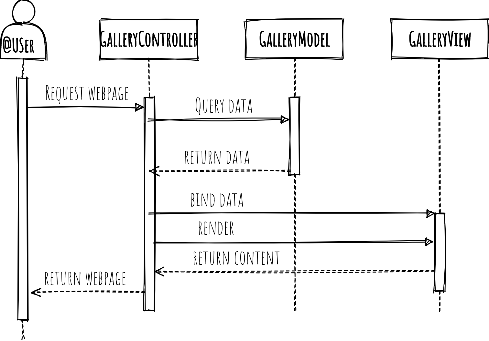

# Kam ukládat soubory?

# Implementace

# Porovnání

<table>

<thead>

<tr>

<th></th>

<th>Databáze</th>

<th>Filesystem</th>

</tr>

</thead>

<tbody>

<tr>

<td>**Uložení**</td>

<td>Binary Large OBject (BLOB)</td>

<td>
do specifického adresáře 

reference z databáze (cesta)</td>

</tr>

<tr>

<td>**Výkon**</td>

<td>
přidána vrstva databáze  

opatrně s dotazy

<pre>Select * FROM</pre>

</td>

<td>závislé na file systému</td>

</tr>

<tr>

<td>**Konzistence**</td>

<td>ACID - vše nebo nic</td>

<td>může zůstat zapomenutý soubor</td>

</tr>

<tr>

<td>**Zálohování**</td>

<td>součást databáze = velké zálohy</td>

<td>prostá kopie včetně adresářové struktury</td>

</tr>

<tr>

<td>**Škálování**</td>

<td>závislé na DB (MySQL = složité, MongoDB = jednodušší)</td>

<td>přidání disku</td>

</tr>

<tr>

<td>**Migrace**</td>

<td>součást databáze = jednoduché</td>

<td>problémy s referencí = možné komplikace</td>

</tr>

<tr>

<td>**Další poznámky**</td>

<td>velké zálohy, omezená maximální velikost souboru</td>

<td>omezený počet souborů v adresáři</td>

</tr>

</tbody>

</table>

## MySQL BLOB datové typy

* TINYBLOB 255 bajtů
* BLOB - 64 KB
* MEDIUMBLOB - 16 MB
* LONGBLOB - až 4 GB

## MongoDB

* BSON - 16 MB
* GridFS > 16 MB

