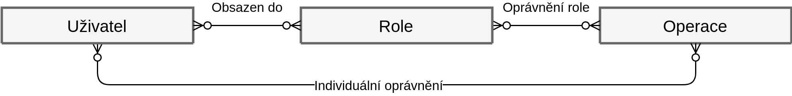

# Oprávnění rolí na úlohy

Uživatel je přiřazen do role, ale zároveň je možno, aby měl nastaveno individuální oprávnění



## Výhody a nevýhody

- groupování uživatelů do rolí
- uživateli lze nastavit konkrétní oprávnění
- snadnější správa mnoha uživatelů

## Implementace:

- **_operace_** je hard-coded list v aplikaci
- **_uživatel_** je tabulka v db
- **_oprávnění přes role_** je tabulka v db, která obsahuje relaci mezi operací a role -> definice oprávnění
- **_oprávnění přes uživatele_** je tabulka v db, která obsahuje relaci mezi operací a uživatelem -> definice oprávnění

```php
if (!máPrávoNaOperaci(  uživatel.id,
                        uživatel.role, 
                        operace.id 
                        )) {
    throw new Exception("...");
}
````

```sql
/**
* @param ID identifikátor uživatele
* @param ROLE role uživatele
* @param ID identifikátor operace
* máPrávoNaOperaci($1, $2, $3)
*/

SELECT EXISTS(
           /*kontrola přes role*/
               SELECT 1
               FROM oprávněníPřesRole as oprávnění
               WHERE oprávnění.id_operace = :taskId
                 AND oprávnění.id_role = :role
               LIMIT 1
               UNION
           /*kontrola přes uživatele*/
               SELECT 1
               FROM oprávněníPřesUživatele as oprávnění
               WHERE oprávnění.id_operace = :taskId
                   AND oprávnění.id_uzivatele = :userId
               LIMIT 1
           )
````


